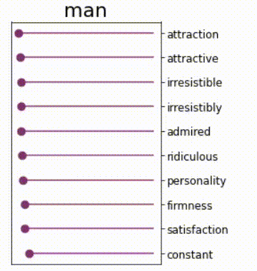
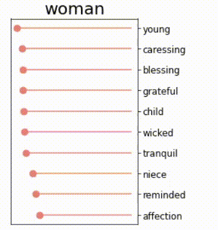
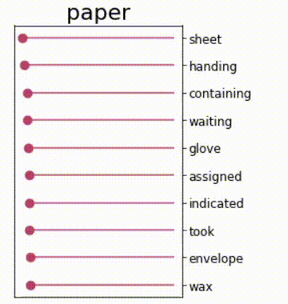
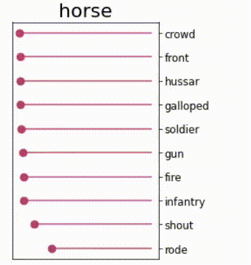
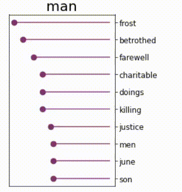
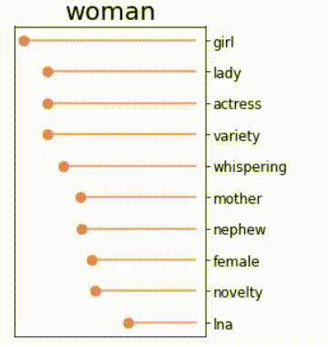
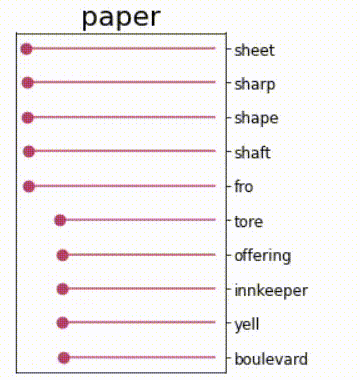
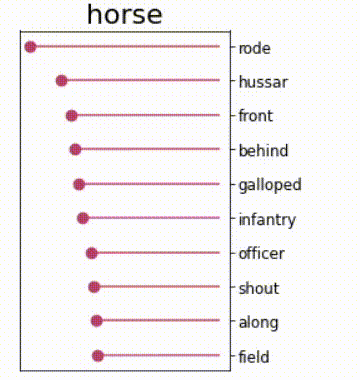

# AIvsBIAS

This is a project to fit Word2Vec embedding without gender bias.

## Motivation

For a long time, the global cultural background has remained highly gender biased. In the 21st century, all these stereotypes are being adopted by machine learning models trained on statistical data and corpora of texts. Here is how it happens: artificial intelligence works with embeddings - representations of words in the form of vectors, where the distance between the codes of words is related to their semantic similarity. Embeddings are trained on large volumes of text, which can not be called gender-neutral (for example, classic literature). As a result, the algorithms can work incorrectly, matching a lot of not always appropriate terms with the words denoting gender identity.

## Proposed solution

We present a gender-neutral language model whose training is done with the use of a special regularization function that allows models to remain gender-neutral even after training on nonbiased datasets.

## Implementation

Project was implemented with using the Pytorch library. The skip-gram architecture was used.

Firstly, we have trained Word2Vec model on Leo Tolstoy's "War and peace" and "Anna Karenina". And than we have applied our "gender-neutralizing" regularization function during training (its implementation you can find in **embeddings.ipynb** notebook). 

As a result, words, which were not marked as gender neutral, had practically equal distances to **man** and **woman** words in the vector space.

Change of the distances to the nearest words for words **man**, **woman**, **paper**, **horse** (last two ones are used as the examples to check out semantic relevance of the feature space) can be seen below.

## Visualization

Distances without regularization:

Distances with regularization:

